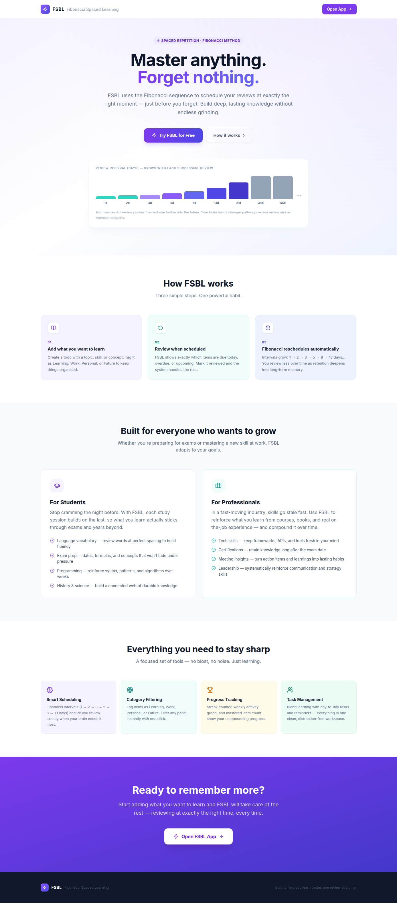
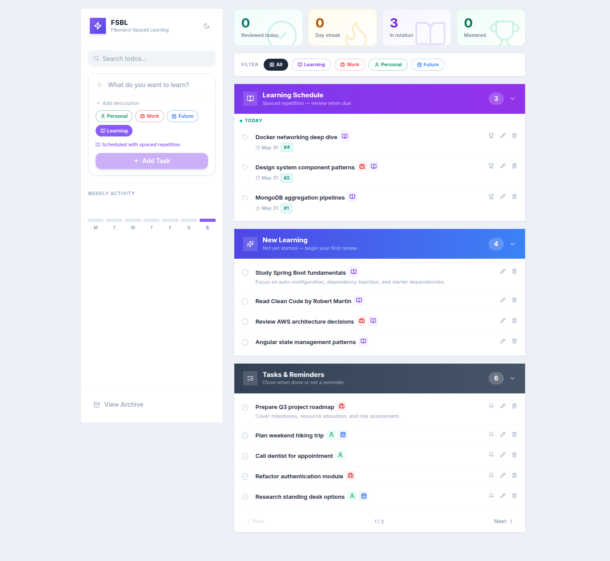

# FSBL — Fibonacci Spaced Learning

[](LICENSE)

A spaced-repetition todo app that schedules reviews using the Fibonacci sequence. Add anything you want to learn, review it when due, and FSBL automatically pushes the next review further out as your retention deepens.

---

## Screenshots

### Landing Page


### App


---

## How It Works

Each time you mark a learning item as reviewed, the next review is scheduled using Fibonacci intervals:

```
1 → 2 → 3 → 5 → 8 → 13 → 21 → 34 → 55 → 89 → 144 → 233 days
```

The interval index advances with each review (cycling via modulo 12). Review less as retention deepens — the system does the scheduling for you.

---

## Features

- **Learning Schedule** — items in active spaced-repetition rotation, grouped into Overdue / Today / Upcoming
- **New Learning** — items not yet started; begin your first review to enter the rotation
- **Tasks & Reminders** — plain tasks with optional reminder dates and snooze (tomorrow / next week / custom date)
- **Global category filter** — filter all panels at once by Learning, Work, Personal, or Future
- **Stats bar** — reviewed today, current day streak, items in rotation, mastered count
- **Weekly activity graph** — visualises review activity across the last 7 days
- **Dark mode** — full dark/light toggle, persisted across sessions
- **Archive** — view and restore completed/closed items
- **Pagination** — each panel shows 5 items per page
- **Tooltips** — every action button, stat card, and filter pill has a descriptive tooltip

---

## Routes

| URL | Description |
|---|---|
| `http://localhost:4200/` | Landing page — overview of FSBL, use cases, how it works |
| `http://localhost:4200/#/app/fsbl-todo` | The app |

---

## Architecture

Two independent sub-projects inside a Docker Compose setup.

### Backend (`backend/`) — Spring Boot 4.1.1 · Java 25 · MongoDB

| File | Purpose |
|---|---|
| `domain/Todo.java` | Request/input DTO (no MongoDB annotations) |
| `entity/TodoEntity.java` | MongoDB document (`@Document(collection="todos")`); unique index on `title` |
| `service/TodoService.java` | Core business logic; holds `fibArray`, implements spaced-repetition scheduling |
| `controller/TodoController.java` | CRUD endpoints under `/api/todos` |
| `controller/StatsController.java` | `GET /api/stats` — reviewed today, streak, active count, mastered count, weekly activity |
| `repository/TodoRepository.java` | Spring Data MongoDB repository |
| `DataLoader.java` | Seeds 13 sample todos on first startup; skips if collection is non-empty |

### Frontend (`frontend/`) — React 18 · Vite 5 · TypeScript · Tailwind CSS · shadcn/ui

| File | Purpose |
|---|---|
| `src/LandingPage.tsx` | Public landing page at `/` |
| `src/App.tsx` | Main app shell, layout, routing state |
| `src/lib/api.ts` | All HTTP calls (native fetch, async/await) |
| `src/types/todo.ts` | `Todo`, `NewTodo`, `Category` TypeScript interfaces |
| `src/hooks/useAllTodos.ts` | Combined state + CRUD for all three panels |
| `src/hooks/useStats.ts` | Fetches stats from `/api/stats` |
| `src/hooks/useDarkMode.ts` | Dark mode toggle, persisted to `localStorage` |
| `src/components/LearningSchedulePanel.tsx` | Paginated list of items in spaced-repetition rotation |
| `src/components/NewLearningPanel.tsx` | Paginated list of items not yet started |
| `src/components/TasksPanel.tsx` | Paginated tasks with reminders |
| `src/components/TodoItem.tsx` | Shared row component used across all panels |
| `src/components/StatsCard.tsx` | 4-tile stats bar with watermark icon effect |
| `src/components/FilterBar.tsx` | Global category filter pills |
| `src/components/Sidebar.tsx` | Left sidebar: logo, search, add form, weekly graph, archive |
| `src/components/CategoryBadge.tsx` | Colour-coded category badge with tooltip |
| `src/components/WeeklyStreakGraph.tsx` | Bar chart of last 7 days of review activity |
| `src/components/ArchiveModal.tsx` | Modal listing completed/closed items |

---

## Running Locally

### Docker Compose (recommended)

```bash
docker compose up --build
```

| Service | URL |
|---|---|
| Frontend | http://localhost:4200 |
| Backend API | http://localhost:8080/api/todos |
| MongoDB | `mongo:27017` (internal only) |

MongoDB data is persisted in the `mongo-data` Docker volume. `DataLoader` seeds 13 sample todos on the very first startup (skips on subsequent starts).

**Wipe all data and re-seed:**
```bash
docker compose down -v && docker compose up --build
```

### Backend only (requires a running MongoDB)

```bash
cd backend
MONGO_DATABASENAME=todoapp MONGO_URL=mongodb://localhost:27017/todoapp ./mvnw spring-boot:run

# Format all Java files (google-java-format via Spotless)
./mvnw spotless:apply

# Check formatting without modifying files (also runs during mvn verify)
./mvnw spotless:check
```

### Frontend only (requires backend on `:8080`)

```bash
cd frontend
npm install
npm run dev        # dev server at http://localhost:5173
npm run build      # type-check + production build → dist/
npm run preview    # preview the production build
```

---

## API Reference

All endpoints are under `/api`.

### Todos — `GET /api/todos`

| Method | Path | Description |
|---|---|---|
| `GET` | `/api/todos` | List all todos |
| `POST` | `/api/todos` | Create a todo |
| `PUT` | `/api/todos/{id}` | Update a todo |
| `DELETE` | `/api/todos/{id}` | Delete a todo |
| `PUT` | `/api/todos/{id}/review` | Mark as reviewed (advances Fibonacci interval) |
| `PUT` | `/api/todos/{id}/master` | Graduate — mark as mastered |
| `PUT` | `/api/todos/{id}/close` | Close / complete a task |
| `PUT` | `/api/todos/{id}/remind` | Set a reminder date |
| `GET` | `/api/todos/revision` | Items due for review today |

### Stats — `GET /api/stats`

Returns `reviewedToday`, `currentStreak`, `activeLearningCount`, `masteredCount`, and `weeklyActivity` (7-element array).

---

## Environment Variables (Backend)

Set automatically by `docker-compose.yml`. Only required when running outside Docker.

| Variable | Description |
|---|---|
| `MONGO_DATABASENAME` | MongoDB database name |
| `MONGO_URL` | MongoDB connection URI |

---

## Tech Stack

| Layer | Technology |
|---|---|
| Backend | Spring Boot 4.1.1, Java 25 |
| Database | MongoDB |
| Frontend build | Vite 5 |
| UI framework | React 18 |
| Language | TypeScript 5 |
| Styling | Tailwind CSS 3 |
| Components | shadcn/ui (Radix UI primitives) |
| Icons | Lucide React |
| Routing | React Router v7 |
| Container | Docker Compose, nginx |

---

## License

Copyright (c) 2026 Kailash Adhikari.

Licensed under the **[Polyform Noncommercial License 1.0.0](LICENSE)**.

You are free to use, modify, and distribute this software for any **non-commercial** purpose — personal projects, education, research, hobby use, and use by non-profit or government organisations are all permitted.

**Commercial use of any kind is prohibited.** This includes, but is not limited to, using this software in a paid product or service, SaaS offering, or any other context where it directly or indirectly generates revenue.

See the [LICENSE](LICENSE) file for the full terms.
